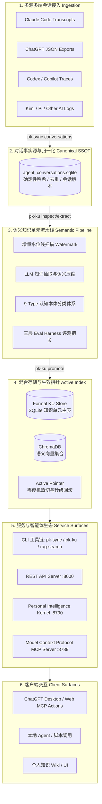

# Personal Knowledge & Intelligence System (个人数据与智能分析系统)

<div align="center">

[](https://python.org)
[](https://nodejs.org)
[-orange.svg)](https://modelcontextprotocol.io)
[](#-系统架构)
[](#-隐私与安全设计保障)
[](LICENSE)

**一个本地优先（Local-First）、隐私至上的个人多端会话资产归一、知识单元（KU）持续蒸馏与智能决策系统。**

[功能特性](#-核心特性) • [系统架构](#-系统架构) • [快速上手](#-快速上手) • [CLI 工作流](#-核心-cli-工作流) • [服务栈与 MCP](#-本地服务栈与-mcp-生态) • [隐私安全保障](#-隐私与安全设计保障)

</div>

---

## 📖 项目简介

在多 AI 协同研发与日常使用时代，我们的思考过程、技术决策和偏好分散在各大客户端（ChatGPT、Claude Code、Codex、GitHub Copilot、Kimi、Pi 等）中。

**Personal Knowledge & Intelligence System** 是一套构建在本地的个人知识资产管理与智能内核基础设施：
1. **多源会话归一化**：自动摄取多端原始会话并进行确定性内容哈希去重，沉淀为统一的不可篡改单一事实源（SSOT SQLite）；
2. **知识单元（Knowledge Unit, KU）蒸馏**：基于 LLM 与 9 种认知分类本体，从海量对话中持续抽取高密度结构化知识单元；
3. **评测与生命周期把关**：内置三层评测 Harness（Recall@K、忠实度、金标回归），支持金丝雀灰度、版本 Supersede 与增量水位线游标；
4. **多端智能接入与 MCP**：提供标准 **Model Context Protocol (MCP)** 服务、**Pi Kernel 任务总线** 及 **REST API**，将本地知识库无缝挂载为 ChatGPT 或其他智能体的长期记忆与工具箱。

---

## 🌟 核心特性

- 🛡️ **100% 本地优先与隐私隔离**：代码完全开源，所有私有对话数据库（`data/`）、知识库与向量集合（`var/`）默认严格本地隔离，绝无云端数据泄露风险。
- 🔄 **多源会话适配矩阵**：开箱即用支持 Claude Code、ChatGPT Export、Codex Sessions、GitHub Copilot Trace、Kimi、Pi、Qoder 等多种会话日志协议。
- 🧠 **L0–L4 语义知识管线**：
  - **9 种认知本体分类**：`preference`（偏好）、`capability`（技能）、`personal_fact`（事实）、`project_decision`（架构决策）、`experience`（踩坑排障）等；
  - **严密生命周期状态机**：`candidate`（候选）$\to$ `canary`（灰度）$\to$ `eval`（评测）$\to$ `promote`（发布）$\to$ `watermark`（游标推进）；
  - **增量水位线与幂等设计**：只提取增量对话，避免全量重复推理消耗 Token。
- 🔍 **混合向量与全文检索引擎**：结合 ChromaDB 向量语义检索与 SQLite FTS5 全文关键词检索，支持双向证据链追溯（Traceable Provenance）。
- 🔌 **标准 MCP 与智能体内核**：
  - **ChatGPT MCP Apps (端口 8789)**：兼容 Model Context Protocol，可在 ChatGPT 中直接调用个人知识检索与分析工具；
  - **Personal Intelligence Kernel (端口 8790)**：Node.js 驱动的持久化任务编排宿主，具备事务账本与自愈能力；
  - **FastAPI / REST API (端口 8000)**：无头检索接口与知识可视化端点。

---

## 🏗️ 系统架构



---

## 💻 环境要求

| 依赖组件 | 版本要求 | 用途说明 |
|---|---|---|
| **操作系统** | Windows 10/11, macOS, Linux | 全平台兼容（Windows 推荐配合 PowerShell 7+） |
| **Python** | $\ge 3.11$（推荐 3.12+） | 核心知识管道、评测、向量与 REST API |
| **Node.js** | $\ge 20.0.0$（Kernel 需 $\ge 22.19.0$） | Pi Kernel 智能宿主与 ChatGPT MCP Server |
| **LLM API** | 通义千问 / OpenAI / Claude / 本地 Ollama | 用于知识单元抽取、语义压缩与判定（通过环境变量配置） |

---

## 🚀 快速上手

### 1. 克隆仓库与配置环境

```bash
git clone https://github.com/adlink8/personal-data-analysis-system.git
cd personal-data-analysis-system

# 创建并激活 Python 虚拟环境
python -m venv .venv
# Windows (PowerShell):
.\.venv\Scripts\Activate.ps1
# Linux / macOS:
# source .venv/bin/activate

# 安装开发与运行依赖
pip install -r requirements-dev.txt
pip install -e .
```

### 2. 初始化应用依赖（Node.js）

```bash
# 安装 ChatGPT MCP 服务依赖
cd apps/personal_data_chatgpt && npm ci && cd ../..

# 安装 Pi Kernel 依赖
cd apps/personal_intelligence_kernel && npm ci && cd ../..
```

### 3. 配置环境变量

系统优先读取运行时环境变量，绝不强依赖本地硬编码配置文件：

```powershell
# Windows (PowerShell)
$env:DASHSCOPE_API_KEY = "your-api-key"       # 用于知识抽取 (通义千问/DashScope)
$env:OPENAI_API_KEY    = "your-openai-key"      # 可选 (OpenAI 模型)

# Linux / macOS (Bash)
export DASHSCOPE_API_KEY="your-api-key"
export OPENAI_API_KEY="your-openai-key"
```

### 4. 一键启动本地服务栈

```powershell
# 启动本地核心服务栈（REST API + Pi Kernel + MCP Server，跳过外网 Tunnel）
pwsh -NoProfile -ExecutionPolicy Bypass -File .\ops\runtime\start-agent-stack.ps1 -SkipTunnel
```

服务就绪检查：
```bash
curl http://127.0.0.1:8000/health    # REST API (Python)
curl http://127.0.0.1:8790/ready     # Pi Kernel (Node)
curl http://127.0.0.1:8789/health    # ChatGPT MCP App (Node)
```

---

## 🛠️ 核心 CLI 工作流

系统将复杂的知识工程与数据治理封装为标准规范的 CLI 工具：

### 1. `pk-sync`：多端对话摄取与同步
```bash
# 检查并预览本地未同步的新对话（Dry-Run，安全只读）
pk-sync conversations

# 确认无误后执行正式同步写入
pk-sync conversations --write
```

### 2. `pk-ku`：知识单元全生命周期管理
```bash
# 查看完整 KU 流水线说明与当前健康诊断
pk-ku workflow
pk-ku doctor

# 检查当前待处理的增量对话
pk-ku inspect

# 执行增量知识提取与金丝雀评测
pk-ku prepare
pk-ku extract
pk-ku canary

# 评测通过后正式 Promote 入库并推进 Watermark 游标
pk-ku promote
pk-ku watermark
```

### 3. `rag-search`：本地混合检索
```bash
# 语义检索知识库
rag-search query "长文本 RAG 架构设计原则"

# 输出当前向量索引状态与统计
rag-search stats --json
```

---

## 🧪 自动化测试与质量保障

项目采用严密的测试金字塔与契约约束：

```bash
# 1. 运行离线测试套件（无需真实私有数据与 LLM 凭证）
python -m pytest -q

# 2. 运行数据治理与路径策略校验
python -m personal_knowledge.governance.preflight --ci

# 3. 运行 Node.js 应用测试
cd apps/personal_data_chatgpt && npm test
cd apps/personal_intelligence_kernel && npm test
```

---

## 🔒 隐私与安全设计保障

本项目在设计之初即将**用户隐私与数据主权**作为第一优先级：

```
                    【代码与数据物理解耦架构】
  ┌─────────────────────────────────────────────────────────────┐
  │  开源代码层（Git 追踪，100% 公开）                          │
  │  • 架构源码 (src/, apps/)                                   │
  │  • 合成测试夹具 (tests/fixtures/*.synthetic.jsonl)          │
  │  • 治理规范与文档 (docs/, governance/)                      │
  └─────────────────────────────────────────────────────────────┘
                                ▲
                    【.gitignore 绝对物理隔离】
                                ▼
  ┌─────────────────────────────────────────────────────────────┐
  │  私有数据层（本地专属，100% 隔离，绝不上传）                │
  │  • data/  ── 原始会话导出、聊天 SQLite (agent_conversations)│
  │  • var/   ── 知识库 SQLite、Chroma 向量数据库、运行时日志   │
  │  • .env*  ── 个人 API 密钥、私有 Token                      │
  └─────────────────────────────────────────────────────────────┘
```

1. **零数据外流**：系统仅在调用您配置的 LLM API 时传输抽取所必需的文本片段，绝不在任何第三方服务器保留您的对话记录；
2. **确定性隔离规则**：所有涉及真实个人对话的目录和格式（`.sqlite`, `.parquet`, `.jsonl`）均在 `.gitignore` 首要屏蔽，确保 `git push` 绝对纯净；
3. **合成测试数据集**：CI/CD 与开源仓库中仅包含用于验证算法契约的手写合成用例（Synthetic Fixtures），绝无任何真实隐私片段。

---

## 📂 项目结构概览

```
personal-data-analysis-system/
├── src/personal_knowledge/      # 核心 Python 知识系统
│   ├── application/             # 核心业务应用：ku 抽取、sync 对话、retrieval 检索
│   ├── core/                    # 路径 SSOT、数据库驱动、安全守卫
│   ├── evaluation/              # 知识评测 Harness 与回归门禁
│   ├── governance/              # 数据与治理策略
│   └── services/                # REST API 服务
├── apps/
│   ├── personal_data_chatgpt/   # ChatGPT MCP 服务与前端 Widget
│   └── personal_intelligence_kernel/ # Node.js 任务与内核引擎
├── assets/                      # 提示词模板、Schema 与公开静态资源
├── docs/                        # 详细架构总览、操作手册与 Runbooks
│   ├── architecture/            # 系统分层、数据流图与 ADR 记录
│   ├── runbooks/                # pk-sync / pk-ku 详细操作手册
│   └── AGENTS.md                # 完整的 AI 协作与工程规范
├── tests/                       # 单元测试、集成测试与离线合成夹具
├── ops/                         # 运行时启动与运维脚本
└── .gitignore                   # 严密的隐私与数据隔离规则
```

**进一步阅读：**

- [docs/architecture/repository-zones.md](docs/architecture/repository-zones.md) — 仓库分区与数据边界总览
- [integration/README.md](integration/README.md) — 集成层脚本与 ingestion 入口说明
- [.planning/ROADMAP.md](.planning/ROADMAP.md) — 阶段路线图与治理基线

---

## 📄 开源许可证

本项目基于 [MIT License](LICENSE) 开源。
